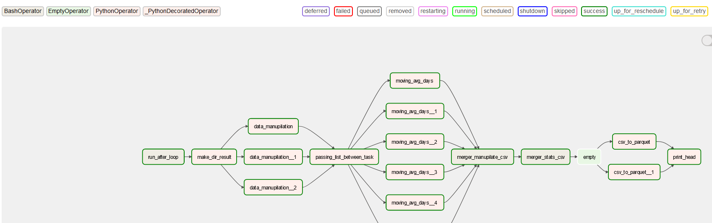
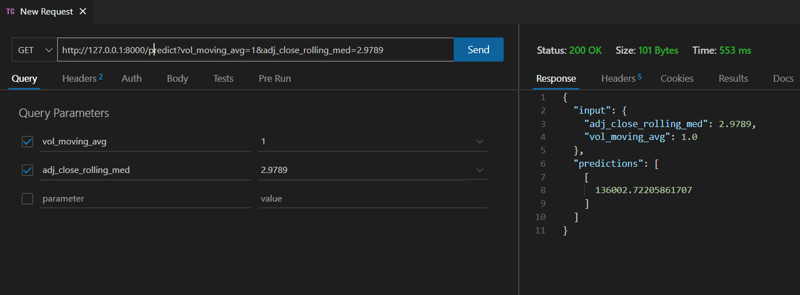

# Working assignment

## Problem 1 and Problem 2

Are sucessfully executed on the airflow. However, due to time constrain, I was not able to implement it on the infrastucture I desired. Therefore, it can be run on more efficient infra and can be optmised to reduce pipeline execution time (Possibly by implementing parlell processing using spark jobs setc.)

## Problem 3 
Due to the same issue of limited resources, this problem is also solved by training the model on Juoyter Notebooks using PySpark. Although we did implemet a pipeline step, but it kept on going to timeout due to less resources, therefore I move towards trainig it on jupyter notebook.

## Problem 4
For this part of problem I created a simple Flask App that has two routes.
> Health of API endoint
 -  `/` 
 - `/health` 
> Prediction API
 - `/predict`
    > The /predict endpoint is a URL or route that is part of an API, which can be used to obtain predictions from a machine learning model.
    
    > /predict endpoint expects a GET request and requires two query parameters, vol_moving_avg and adj_close_rolling_med. These parameters are expected to be floating-point numbers representing financial indicators.
    
    When a GET request is made to this endpoint, the API will extract the values of the query parameters and use them to create a Spark DataFrame, which is passed to a machine learning model to generate predictions.

The output of the model, which is a DataFrame of predicted values, is then converted to a JSON format response that includes both the input values and the predicted values. This response can be consumed by other applications or services that need access to the predictions generated by the model.

### Problem 3 Usage
> Use the command given below to run image of pyspark with jupyternotebook

    docker run -it --rm -p 8888:8888 -p 8000:8000  -p 5000:5000 jupyter/pyspark-notebook

> Upload `API.ipynb` or `api/app.py` to Docker via Notebook or other means.
> Run the cells in `API.ipynb` or run the `python app.py`

> make request to 
>> 
http://127.0.0.1:8000/predict?vol_moving_avg=*&adj_close_rolling_med=*

> with the input data

The Prediction API would respond with a Json with the prediction like below.

Possibly already running at https://roni712-potential-telegram-rr9xxvj7r49cw5wp-8000.preview.app.github.dev
> This is in codespace and it has hosting limit for 4 hrs.

### ToDo

In future iteration features to add
-- logging & monitoring
-- exporatory analysis before model fiting
-- add standalone spark cluster make ETL job more faster